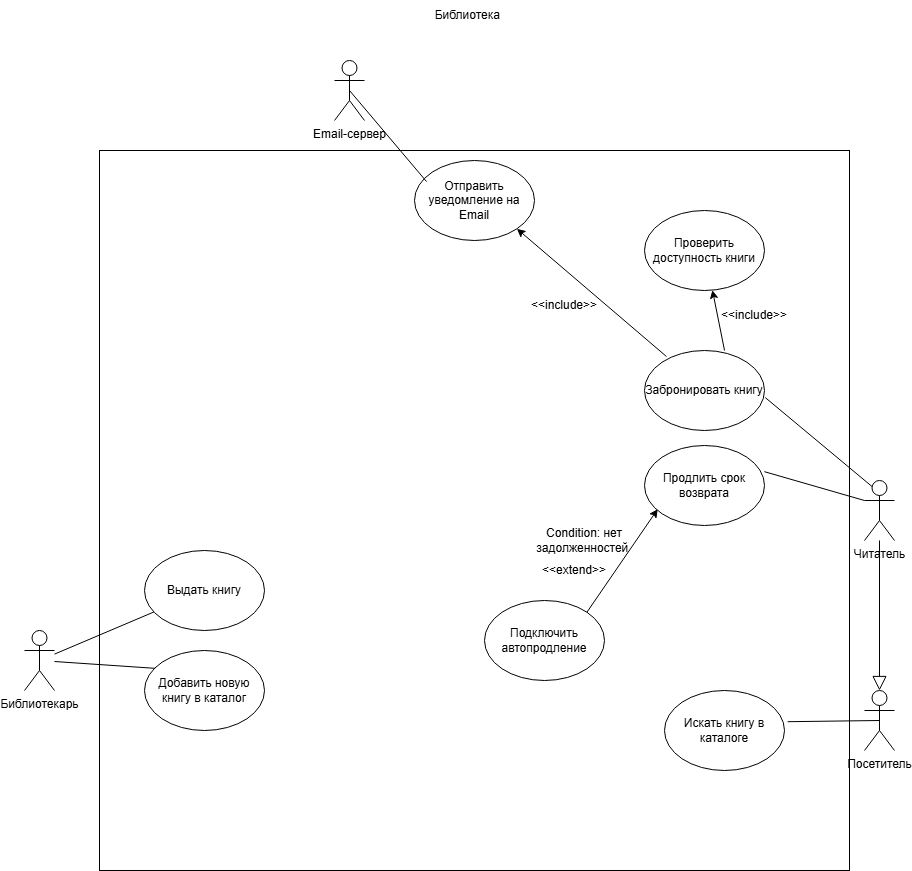
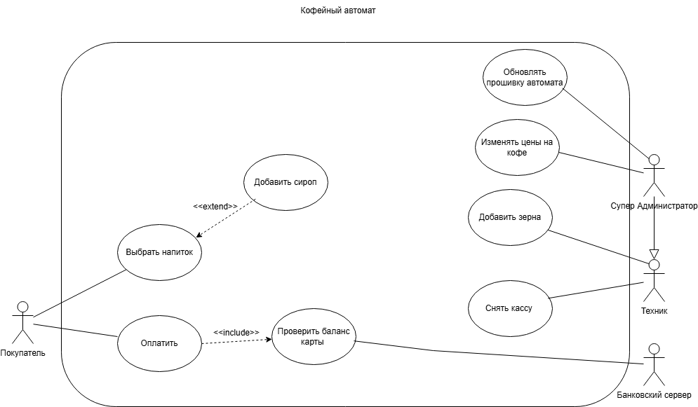

# Use Case Diagrams 

Collection of UML Use Case diagrams and system analysis models for various applications.

---

📚 Library Management System
An advanced use case model designing the business logic for a library application 

System Overview:
Actors:** Visitor, Reader (Inheritance applied), Librarian.

External Systems:** Email Server for automated notifications.

UML Features Used:** Actor generalization, `<<include>>` for 
mandatory sub-processes, and `<<extend>>` for optional conditions (e.g., auto-renewal).

---

☕ Coffee Vending Machine
A foundational system architecture demonstrating primary external interactions and core business flows.

System Overview:
Actors:** Customer, Technician, Super Administrator (Inheritance).

External Systems:** Bank Server for payment validation.

UML Features Used:** System boundaries, standard associations, and basic dependencies.

